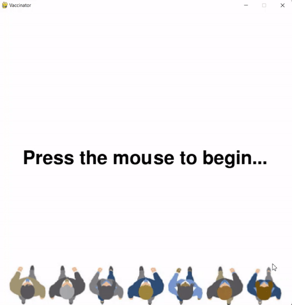

# Vaccinator

Vaccinator is a covid-19 themed game based on the pandemic. The goal of the game is to survive as many outbreaks of covid-19 as possible. The player is the vaccine, it is your job to take down as many viruses as you can while protecting the people behind you from getting infected. Press the arrow keys to move and the spacebar to shoot. Every time the vaccine gets hit by a virus, the vaccine loses health, and once the player's health is zero the game is over. There is also another catch, if the virus reaches the people at the bottom, you lose a life. Once all the people are infected the game is over, and it will automatically restart. This is a solo project that was submitted to [Hack-cade
Hosted by MLH](https://organize.mlh.io/participants/events/6798-hack-cade)

## Getting Started

These instructions will get you a copy of the project up and running on your local machine for development and testing purposes. See deployment for notes on how to deploy the project on a live system.

### Prerequisites

- The first requirement is to have any version of python3 downloaded on the device the program will be run on
- The second requirement would be to download pygame

### Installing

Python can be done off the following link: [https://www.python.org/downloads/](https://www.python.org/downloads/).

Pygame can be downloaded using the following commands in the command prompt:

With pip:

```
> pip install pygame
```

## Deployment
Here are the steps to deploy the program:

1. Download the code from GitHub
2. Run code in any way you wish, eg. through text editor like atom by pressing Ctrl+Shift+b, or through command prompt

## Demo
[](https://github.com/MuhammadZ985/Covid-19-Game)

## Built With

* [python3](https://www.python.org/downloads/) - The language used
* [pygame](https://www.pygame.org/download.shtml) -  Dependency

## Authors

* **Muhammad Zaman** - *Sole Creator* - [MuhammadZ985](https://github.com/MuhammadZ985)

## License

This project is licensed under the MIT License - see the [LICENSE.md](LICENSE.md) file for details
